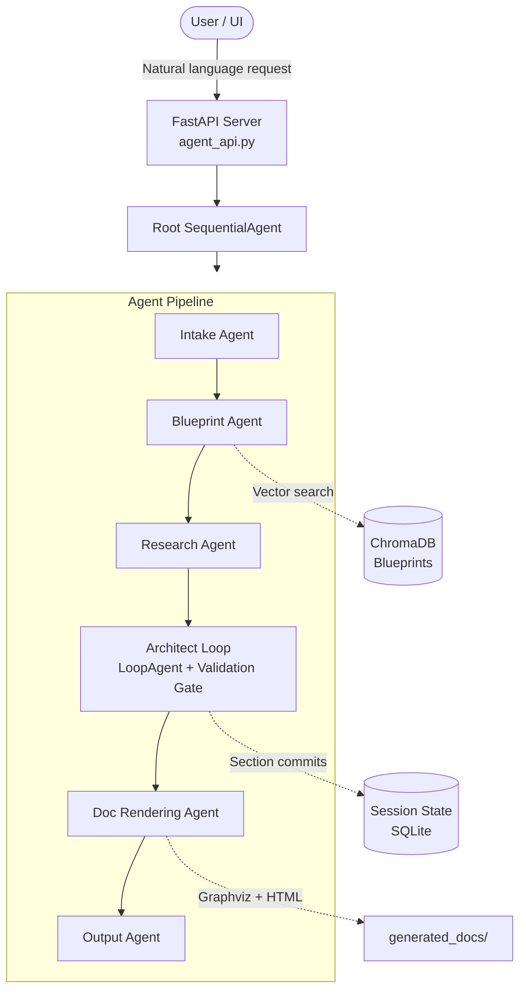

# AIA — Architectural Intelligence Agent

An enterprise-grade, multi-agent system that **automatically generates High-Level Design (HLD) documents** from natural-language project requirements. Built on the [Google Agent Development Kit (ADK)](https://google.github.io/adk-docs/) and powered by **Gemini LLMs**, the engine orchestrates a sequential pipeline of specialised AI agents — from requirements intake through blueprint discovery, technical research, architecture generation, and final document rendering (HTML / PDF).

---

## Table of Contents

- [Overview](#overview)
- [Architecture](#architecture)
- [Agent Pipeline](#agent-pipeline)
- [Project Structure](#project-structure)
- [Tech Stack](#tech-stack)
- [Prerequisites](#prerequisites)
- [Configuration](#configuration)
- [Getting Started](#getting-started)
- [API Endpoints](#api-endpoints)
- [Blueprint Ingestion](#blueprint-ingestion)
- [HLD Schema](#hld-schema)
- [Tools Reference](#tools-reference)
- [Docker Deployment](#docker-deployment)

---

## Overview

The **AIA (Architectural Intelligence Agent)** automates the creation of enterprise HLD documents. A user describes their project in conversational language and the system:

1. **Collects** structured requirements (project name, source/target systems, security, NFRs, etc.)
2. **Searches** a ChromaDB vector store for relevant architecture blueprints and standards
3. **Researches** technical gaps, resolves GCP services, and maps integration patterns
4. **Architects** a full HLD — section by section — validated against a Pydantic schema
5. **Renders** the final document as a branded HTML report with Graphviz/Mermaid diagrams and a downloadable PDF

The entire workflow supports **revision loops** — after a document is generated, users can request changes and the system selectively re-generates only the affected sections.

---

## Architecture



---

## Agent Pipeline

| # | Agent | Responsibility | Key Tools |
|---|-------|---------------|-----------|
| 1 | **Intake Agent** | Collects and validates project requirements against `IntakeSchema`. Handles revision context for re-runs. | `store_in_state` |
| 2 | **Blueprint Agent** | Searches the ChromaDB blueprint vector store for relevant architecture standards and patterns. | `search_blueprint_bundle` |
| 3 | **Research Agent** | Performs technical gap analysis — maps intake + blueprints to concrete GCP services and integration facts. | `store_in_state` |
| 4 | **Architect Agent** | Generates HLD content section-by-section, committing each section to state. Wrapped in a `LoopAgent` with a validation gate that retries failed/missing sections. | `commit_hld_*` (per-section tools), `commit_hld_to_memory` |
| 5 | **Doc Rendering Agent** | Renders the validated HLD JSON into branded HTML with Graphviz diagrams and PDF export. | `render_hld` |
| 6 | **Output Agent** | Presents final download links to the user and handles post-render revision requests. | `store_in_state` |

### Workflow Control

- **SequentialAgent** enforces step ordering; each agent must complete before the next starts.
- **LoopAgent** (Architect Loop) re-runs the Architect + Validation Gate until all required HLD sections pass quality checks.
- **Validation Gate** (`architect_loop.py`) inspects committed sections, detects missing/invalid content, and queues section-level retries.
- **State Keys** (`workflow/keys.py`) provide a single source of truth for all workflow flags across agents.

---

## Project Structure

```
agentic_ai/
└── aia_hld_backend/               # Main application package
    ├── agent_api.py               # FastAPI entry point (ADK app, CORS, endpoints)
    ├── config_load.py             # Pydantic-settings config loader (YAML-based)
    ├── Dockerfile                 # Multi-stage Docker build (builder + runtime)
    ├── requirements.txt           # Python dependencies
    │
    ├── agent/                     # Agent definitions
    │   ├── agent.py               # Root SequentialAgent (orchestrator)
    │   ├── prompt.py              # Root agent system prompt
    │   ├── logging_setup.py       # Centralized logger
    │   │
    │   ├── intake_agent/          # Requirements collection agent
    │   ├── blueprint_agent/       # Blueprint vector search agent
    │   ├── research_agent/        # Technical research agent
    │   ├── architect_agent/       # HLD generation agent
    │   ├── doc_rendering_agent/   # HTML/PDF rendering agent
    │   ├── output_agent/          # Final output & revision agent
    │   │
    │   ├── workflow/              # Orchestration logic
    │   │   ├── architect_loop.py  # LoopAgent + Validation Gate
    │   │   └── keys.py            # Centralized state key constants
    │   │
    │   └── blueprints/            # Architecture blueprint documents
    │       ├── cost/              # Cost estimation patterns
    │       ├── deployment_strategy/
    │       ├── gcp/               # GCP architecture patterns
    │       ├── ingestion/         # Data ingestion patterns
    │       ├── migration/         # Migration strategies
    │       ├── nfr/               # Non-functional requirements
    │       ├── secrets/           # Secrets management patterns
    │       ├── security/          # Security architecture standards
    │       ├── shared_services/   # Shared service blueprints
    │       └── generic/           # Generic templates
    │
    ├── configs/
    │   └── lab.yaml               # Environment config (GCP project, model, endpoints)
    │
    ├── schema_types/              # Pydantic schemas
    │   ├── hld_schema.py          # HLDReport — full HLD document schema
    │   └── aia_intake_schema.py   # IntakeSchema — requirements contract
    │
    ├── tools/                     # ADK FunctionTools
    │   ├── state_store.py         # State persistence tool
    │   ├── commit_hld_to_memory.py        # HLD commit signal tool
    │   ├── hld_section_commit_tools.py    # Per-section commit + validation
    │   ├── search_vector_blueprints.py    # ChromaDB blueprint search
    │   ├── doc_render_tools.py    # HTML/PDF rendering tool
    │   ├── kb_search.py           # Knowledge base vector search
    │   └── pdf_processor.py       # PDF text extraction (pdfplumber)
    │
    ├── renderers/                 # Rendering engines
    │   ├── html_renderer.py       # HTML template renderer
    │   └── diagram_renderer.py    # Mermaid → Graphviz → PNG converter
    │
    ├── shared_util/
    │   └── auto_correct_schema_shapes.py  # Auto-fix agent output shapes
    │
    ├── scripts/                   # Utility scripts
    │   ├── chromab_upload.py      # ChromaDB connectivity test
    │   ├── fetch_docs.py          # Test queries against ChromaDB
    │   ├── ingest_blueprints_vertexai.py  # Blueprint ingestion (Vertex AI embeddings)
    │   └── ingest_blueprints_json.py      # Blueprint ingestion (JSON)
    │
    └── generated_docs/            # Output directory for rendered HLDs
```

---

## Tech Stack

| Layer | Technology |
|-------|-----------|
| **Framework** | [Google ADK](https://google.github.io/adk-docs/) (Agent Development Kit) |
| **LLM** | Google Gemini (configurable via `LLM_MODEL` — default `gemini-2.5-flash`) |
| **API** | FastAPI + Uvicorn |
| **Vector Store** | ChromaDB (persistent, with Vertex AI / SentenceTransformer embeddings) |
| **Session Store** | SQLite (via ADK session DB) |
| **Schema Validation** | Pydantic v2 |
| **Document Rendering** | Graphviz, Mermaid, xhtml2pdf, markdown2 |
| **PDF Processing** | pdfplumber |
| **Config** | pydantic-settings + YAML |
| **Containerization** | Docker (multi-stage build) |
| **Cloud** | Google Cloud Platform (Cloud Run, GCS, Vertex AI) |
| **Language** | Python 3.10+ |

---

## Prerequisites

- **Python 3.10+**
- **Google Cloud SDK** with authenticated credentials
- **Graphviz** installed locally (`brew install graphviz` on macOS)
- **Poppler** for PDF utilities (`brew install poppler`)
- Access to a GCP project with Vertex AI APIs enabled

---

## Configuration

Configuration is loaded from YAML files under `configs/` based on the `RUN_ENV` environment variable.

```bash
export RUN_ENV=lab    # loads configs/lab.yaml
```

### Key Configuration Values (`configs/lab.yaml`)

| Variable | Description |
|----------|-------------|
| `PROJECT_ID` | GCP project ID |
| `REGION` | GCP region |
| `LLM_MODEL` | Gemini model name (e.g. `gemini-2.5-flash`) |
| `GCS_BUCKET_NAME` | GCS bucket for document storage |
| `EMBEDDING_MODEL_NAME` | Vertex AI embedding model |
| `LLM_PROXY_ENDPOINT` | LLM proxy service URL |
| `SESSION_DB_URL` | SQLite DB URL for sessions |
| `SERVE_WEB_INTERFACE` | Enable/disable ADK web UI |

---

## Getting Started

### 1. Clone & Setup Virtual Environment

```bash
cd aia_hld_backend
python3.10 -m venv venv
source venv/bin/activate
pip install -r requirements.txt
```

### 2. Configure Environment

```bash
export RUN_ENV=lab
export GOOGLE_CLOUD_PROJECT=<your-gcp-project>
export GOOGLE_GENAI_MODEL=gemini-2.5-flash
```

### 3. Run the Server

```bash
cd aia_hld_backend
python agent_api.py
```

The server starts at `http://localhost:8000`. If `SERVE_WEB_INTERFACE=True`, the ADK web UI is available at the root URL.

### 4. Interact

Send a natural-language architecture request via the ADK web interface or API:

> *"I need an HLD for a data migration project moving customer data from Teradata to BigQuery. The data residency is UK, we need AES-256 encryption, and the deployment strategy is blue-green on GCP Cloud Run."*

The system will guide you through any missing requirements, search for relevant blueprints, and generate a full HLD document.

---

## API Endpoints

| Method | Path | Description |
|--------|------|-------------|
| `GET` | `/health` | Health check |
| `GET` | `/api/hld_sections` | Returns dynamic list of HLD sections from schema |
| `GET` | `/download/{filename}` | Download a generated document |
| `GET` | `/generated_docs/{path}` | Static file serving for rendered documents |
| | `/run`, `/run_sse` | ADK agent execution endpoints (provided by ADK) |

---

## Blueprint Ingestion

Architecture blueprints (`.docx`, `.xlsx`, `.json`) are stored under `agent/blueprints/` organized by domain area:

- `cost/` — Cost estimation templates
- `deployment_strategy/` — Deployment patterns
- `gcp/` — GCP architecture standards
- `ingestion/` — Data ingestion patterns
- `migration/` — Migration strategies
- `nfr/` — Non-functional requirements
- `secrets/` — Secrets management
- `security/` — Security architecture
- `shared_services/` — Shared service patterns

### Ingest Blueprints into ChromaDB

```bash
# Using Vertex AI embeddings
python scripts/ingest_blueprints_vertexai.py

# Verify ingestion
python scripts/fetch_docs.py
```

---

## HLD Schema

The HLD output follows a structured Pydantic schema (`schema_types/hld_schema.py` — `HLDReport`):

| Section | Description |
|---------|-------------|
| Document Metadata | Template info, classification, domain |
| Project Details | Name, code, version, deployment context |
| Document Control | Version history, reviewers, approvers |
| Executive Summary | High-level project summary |
| Summary of Functionality | Functional overview |
| Supporting Artefacts | Related documents and references |
| RAID | Risks, Assumptions, Issues, Dependencies |
| Design Decisions | Key architecture decisions and rationale |
| Architecture Design Views | Logical, Physical, and Process views (with diagrams) |
| Data Design & Models | Data flow, storage, subject areas, logical data model |
| Component / Entity Summary | System component inventory |
| System Interfaces | Internal, external, M2M, P2M interfaces |
| Security Architecture | Security zones, access control, encryption, auditing |
| Solution Checks & NFRs | Compliance, operational performance, cost considerations |
| Glossary | Terms and definitions |

---

## Tools Reference

| Tool | File | Purpose |
|------|------|---------|
| `store_in_state` | `tools/state_store.py` | Persist key-value pairs to session state |
| `commit_hld_to_memory` | `tools/commit_hld_to_memory.py` | Signal orchestrator that HLD JSON is ready |
| `commit_hld_*` (dynamic) | `tools/hld_section_commit_tools.py` | Per-section HLD commit with validation |
| `search_blueprint_bundle` | `tools/search_vector_blueprints.py` | Vector search over architecture blueprints |
| `render_hld` | `tools/doc_render_tools.py` | Render HLD JSON to HTML + PDF |
| `search_knowledge_base` | `tools/kb_search.py` | ChromaDB search for technical documentation |
| `read_pdf_hybrid` | `tools/pdf_processor.py` | Extract text from PDF documents |

---

## Docker Deployment

The project uses a multi-stage Docker build optimized for production:

```bash
# Build
docker build \
  --secret id=gcp_adc,src=$HOME/.config/gcloud/application_default_credentials.json \
  --build-arg RUN_ENV=lab \
  -t aia-hld-backend .

# Run
docker run -p 8000:8000 \
  -e RUN_ENV=lab \
  -e GOOGLE_CLOUD_PROJECT=<your-project> \
  aia-hld-backend
```

### Runtime Dependencies (installed in Docker)

- `libcairo2` — SVG/PDF rendering
- `poppler-utils` — PDF processing
- `graphviz` — Diagram generation
- `tesseract-ocr` — OCR capabilities
- `libgomp1` — NumPy/ONNX runtime support

---

## License
